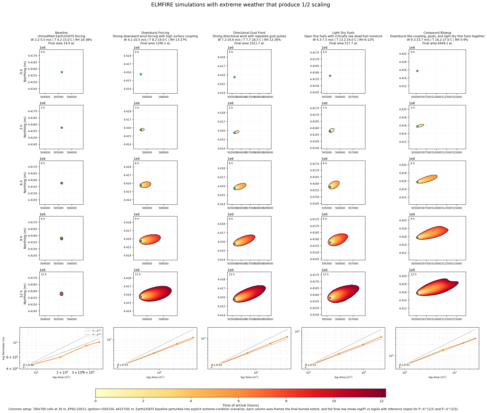

# Fire POC Workflow Buildout

This page documents the full `fire_poc` workflow that was built to support proposal figures comparing an `ELMFIRE` benchmark against a simple regime-aware fire model. It is intentionally detailed because the point of the workflow is not only to make a figure, but to make a figure whose provenance is clear. The build now includes a local package, a CLI, a notebook path, an Earth2Studio-backed weather provider, a deterministic mock fallback, a real ELMFIRE case writer, a runner that preserves truthful execution status, a labeled map product derived from real ELMFIRE outputs, and a multi-scenario extreme-conditions panel. The package lives under `simulations/fire_poc/` so that exploratory machinery remains isolated from the main proposal narrative while still being documented closely enough to support later methods writing.

The central architectural decision was to separate data acquisition, case writing, external execution, comparison modeling, and plotting rather than bundling everything into one script. That separation allows the workflow to remain useful when one part is missing. If Earth2Studio is unavailable, the mock provider still makes the notebook and CLI usable. If ELMFIRE is unavailable, the case writer still produces a complete directory with rasters, namelist, ignition file, and manifest. If ELMFIRE runs successfully, the workflow records that truthfully even if a fully general output parser is not yet implemented. This design makes the package more verbose than a quick prototype, but it also makes it much safer to use in a proposal context where figures can easily outlive the memory of how they were generated.

## Architecture schematic

```text
user / notebook / CLI
        |
        v
  fire_poc.cli
        |
        v
  compare.py
        |
        +------------------------------+
        |                              |
        v                              v
 make_provider()                RegimeAwareModel.run()
        |                              |
        |                              v
        |                      perimeters + area series
        v
 mock_provider.py  or  earth2_provider.py
        |
        v
   Forcing dataclass
        |
        +------------------------------+
        |                              |
        v                              v
 forcing.json                   ElmfireRunner.run()
                                       |
                                       v
                               ElmfireCaseWriter.write_case()
                                       |
                                       +--> GeoTIFF weather stacks
                                       +--> GeoTIFF fuels/topography rasters
                                       +--> elmfire.data
                                       +--> ignition_points.json
                                       +--> manifest.json
                                       +--> run_elmfire.sh
                                       |
                                       v
                               external elmfire executable
                                       |
                                       +--> stdout/stderr logs
                                       +--> ENVI/BIL outputs
                                       +--> fire_size_stats.csv
                                       |
                                       v
                                   BenchmarkStatus
        |
        v
 plotting.py
        |
        +--> comparison figure
        +--> labeled time-sequence map
        +--> extreme-conditions panel
        +--> status manifests
```

The forcing layer is built around one common `Forcing` dataclass that stores time in hours, wind speed, wind direction, temperature, relative humidity, pressure, precipitation, and free-form metadata. That abstraction is what allows the same weather object to feed both the real ELMFIRE benchmark path and the pure Python regime-aware model. The mock provider uses deterministic synthetic weather so the entire workflow can run locally without outside services. The Earth2 path uses `earth2studio` and the documented `GEFS_FX` source with variables `u10m`, `v10m`, `t2m`, `r2m`, and `sp`. Those fields are reduced to a domain-mean time series over the current box, converted into wind speed and meteorological direction, and stored in the same forcing object as the mock path. The present design therefore uses Earth2Studio as a real weather-source interface and reduction layer, not as a full counterfactual digital-twin engine.

The ELMFIRE case writer in `src/fire_poc/elmfire_case.py` is the part of the system that turns the forcing object into something an external model can actually consume. It writes transient weather rasters for `ws`, `wd`, `m1`, `m10`, `m100`, `adj`, and `phi`, and static fuels/topography rasters for `slp`, `asp`, `dem`, `fbfm40`, `cc`, `ch`, `cbh`, and `cbd`. These are written as real GeoTIFFs with `rasterio`. The writer also produces a valid `elmfire.data` namelist, a point ignition sidecar, a manifest, and a small helper run script. Several current settings matter enough to state directly. Wind speeds are written in miles per hour because that matches the benchmark setup we converged on for ELMFIRE. `WS_AT_10M = .TRUE.` is written explicitly. `DT_METEOROLOGY` is derived from the forcing cadence. `NUM_METEOROLOGY_TIMES` is set from the forcing length. `SIMULATION_DT = 5.0`, `TARGET_CFL = 0.2`, and `DUMP_TIME_OF_ARRIVAL = .TRUE.` are currently used because the workflow is optimized around inspectable arrival-time products.

One of the most important debugging fixes was the ignition coordinate convention. Earlier case files wrote ignition coordinates as local offsets, which caused ELMFIRE to crash during initialization because it expected absolute CRS coordinates when indexing the input rasters. The current writer preserves both local and absolute ignition positions in `ignition_points.json` for readability, but writes absolute `X_IGN` and `Y_IGN` values into `elmfire.data`. Another late refinement was making reruns safe. Repeated ELMFIRE runs were leaving multiple output rasters in the same scenario directories, which could silently mix older and newer products. The writer now clears previously generated case artifacts before writing a fresh case, and the plotting layer resolves matching output products by newest modification time rather than by alphabetical order.

The runner in `src/fire_poc/elmfire_runner.py` is deliberately conservative. It prepares the case, attempts the external command if one was provided, captures stdout and stderr, and returns a structured `BenchmarkStatus` object. If no executable is supplied, the status is `case_written_run_skipped` and the benchmark type is `case-written-only`. If the executable cannot be found, the status is `run_failed_missing_executable`. If the executable runs successfully, the benchmark type becomes `real ELMFIRE`, even if the parser boundary remains incomplete. This is why the package can produce useful artifacts even when the benchmark path is partially unavailable while still avoiding the more serious mistake of implying that a real benchmark ran when it did not.

The regime-aware model remains simple on purpose. It lives in `src/fire_poc/regime_model.py` and evolves an ellipse through time with a regime transition triggered by either a wind threshold or a time threshold. Its value is not that it is an operational fire model. Its value is that it provides a transparent comparison branch that is easy to inspect in both the CLI and the notebook and helps illustrate what the workflow is doing when ELMFIRE is absent or when a side-by-side conceptual comparison is useful.

The plotting layer now supports three kinds of outputs. The first is the single-run comparison figure that overlays the benchmark status with the regime-aware model and the forcing history. The second is a labeled time-sequence map generated from real ELMFIRE `time_of_arrival` output and `fire_size_stats.csv`; this figure is used when the benchmark actually completes and provides a map view plus a parameter panel. The third is the extreme-conditions panel where time proceeds down the rows and scenario variants proceed across columns. That panel is where most of the late design work landed, because it needed to be visually distinct enough to support proposal messaging rather than just proving that the code could rerun the same case multiple times.

One plotting bug that surfaced only after the panel became large enough to inspect carefully is worth recording explicitly. The ELMFIRE `time_of_arrival` rasters are stored in top-origin image order, but the initial panel code drew them as though row zero belonged at the lower edge of the map. That mirrored the fire vertically and made the ignition star appear to sit far away from the burn even though the simulation input itself was correct. The current plotting code flips ENVI/BIL rasters into map orientation before drawing them, so the ignition star, arrival raster, and burned contours now occupy the same coordinate frame. This is the kind of small implementation detail that can easily undermine trust in a figure if it is not written down.

The extreme-scenarios workflow begins with an Earth2-backed baseline forcing and then clones it into several explicit scenario variants in `compare.py`. The current columns are `Baseline`, `Downburst Forcing`, `Directional Gust Front`, `Light Dry Fuels`, and `Compound Blowup`. The downburst case strengthens wind through time, fixes a stronger direction, raises temperature modestly, reduces humidity, and increases surface coupling. The directional gust case uses repeated wind pulses and a fixed strong direction to force anisotropic spread. The light-dry-fuels case raises temperature sharply, depresses RH, lowers dead-fuel moisture, and opens the canopy. The compound case stacks those mechanisms. These are not hidden statistical perturbations. They are explicit code-level scalars that can be read and edited directly.

To keep those scenarios from looking unrealistically smooth, the case writer now injects deterministic spatial heterogeneity into wind exposure, directional bending, dead-fuel moisture, terrain, slope, aspect, canopy structure, and coupling fields. The heterogeneity is aligned to the mean downwind direction and is built from corridor, lee-shadow, ridge, streak, and dry-patch patterns. This does not claim to reproduce resolved turbulence. What it does is give the benchmark landscape enough structured variability that the perimeter roughness becomes visually informative rather than embarrassingly idealized.

The panel also needed more actual simulation space, not merely better framing. The strongest scenarios were beginning to look constrained by the computational box itself, so the current extreme-panel domain is now larger and the ignition is intentionally shifted upwind. The present settings are `700 x 700` cells at `30 m` resolution, corresponding to `21.0 km x 21.0 km`, with ignition placed at `x = 5,250 m` and `y = 15,750 m` relative to the lower-left corner of the domain. That asymmetry is deliberate because the strongest fires predominantly run toward the east-southeast. The plotting code still auto-frames each column to the final burned extent so the figure uses space efficiently, but the underlying domain now gives the fire more genuine room to grow before the figure is drawn. A direct raster-edge check on the latest panel run confirmed that none of the five scenarios touches the computational boundary.

The panel now ends with a final scaling row. For each scenario, the bottom subplot is a log-log plot of perimeter versus area computed directly from the burned masks at the same snapshot times shown above. Each panel includes a fitted exponent `beta` from `log(P)` versus `log(A)` and two reference curves corresponding to `P ~ A^(1/2)` and `P ~ A^(2/3)`. This matters because the figure is no longer only a visual comparison of map shapes; it now also gives a compact geometric diagnostic of whether a scenario is behaving closer to a smoother perimeter-growth law or a rougher superlinear perimeter law. The current figure therefore supports both qualitative interpretation and a first-pass scaling argument in one place.

## Current extreme panel

The latest website copy of the extreme-conditions figure is shown below. This asset is synchronized from the current run output at `simulations/fire_poc/outputs/extreme_panel/figures/extreme_conditions_panel.png` so the site reflects the actual current state of the workflow rather than an older placeholder image.



In the current version, the upper rows show five real ELMFIRE benchmark runs driven by a common Earth2/GEFS baseline and then perturbed into `Baseline`, `Downburst Forcing`, `Directional Gust Front`, `Light Dry Fuels`, and `Compound Blowup` cases. The latest rerun produced final burned areas of approximately `14.0 ac`, `1290.1 ac`, `1011.7 ac`, `517.7 ac`, and `6449.2 ac` respectively. The ignition star is now aligned with the burned footprint, the strong runs have more real domain room to grow, and the bottom row shows the current perimeter-area scaling behavior in the direct `log(P)` versus `log(A)` form.

The package currently supports two practical interfaces. The notebook at `notebooks/elmfire_earth2_poc.ipynb` walks through setup, provider selection, forcing fetch, case writing, benchmark attempt, regime-aware model run, figure creation, and file inspection. The CLI exposes the same logic through `python -m fire_poc.cli`, with `--mode compare` for the single-run path and `--mode extremes-panel` for the multi-scenario ELMFIRE panel. The most important operational setting for the Earth2 path is the time step: `--step-hours 3` is required for the current GEFS fetch range in this build.

The environment story is an essential part of the workflow rather than an incidental detail. The original project environment at `simulations/fire_poc/.venv` uses `Python 3.9.6`, which was enough for the initial scaffold but not sufficient for `earth2studio` on this machine. A separate environment was therefore created at `simulations/fire_poc/.venv312` using `uv`, and that environment now hosts the Earth2-backed workflow. The active Earth2 environment currently reports `Python 3.12.8`, `earth2studio 0.13.0`, `numpy 2.4.4`, `matplotlib 3.10.8`, and `rasterio 1.5.0`. That split environment design is not elegant, but it is honest and stable, which matters more for proposal support than cosmetic simplicity.

Several programs had to be installed locally to make the real benchmark path work on the Mac M3. `uv 0.5.26` was used to create and manage the Earth2-capable Python 3.12 environment. Homebrew `gcc 15.2.0_1`, specifically `gfortran 15.2.0`, was needed to compile the upstream ELMFIRE source into a native executable. Homebrew `open-mpi 5.0.9`, exposed through `mpirun 5.0.9`, was installed because ELMFIRE expects an MPI-aware build and runtime ecosystem even when the current proof-of-concept runs are effectively local and single-job. Homebrew `gdal 3.12.3` was critical because ELMFIRE uses `gdal_translate` during its own raster-conversion path, and the case writer now detects `/opt/homebrew/bin` and passes that location into `elmfire.data`. Without those installations, the workflow could write cases but could not honestly claim a real local ELMFIRE run.

The bring-up sequence for ELMFIRE matters because it explains the current confidence level. The workflow did not jump directly from package scaffold to successful benchmark. It moved through missing executable errors, build-toolchain issues, GDAL conversion issues, path problems, and a native initialization crash that had to be debugged to the ignition-coordinate level. After those fixes, the proof-of-concept case completed successfully on the Mac, wrote real ELMFIRE outputs, and produced a labeled time-sequence map and an extreme-conditions panel derived from actual benchmark runs. That history is exactly why the page is worth writing down: the current result is not just a diagrammed design, it is a path that has already been tested against the messy parts of reality.

The workflow still has clear limits. Earth2Studio is presently used as a domain-mean GEFS forcing source rather than a fully spatial counterfactual engine. The regime-aware model is intentionally minimal. The benchmark parser is still specialized around the outputs needed for current figures rather than around every product ELMFIRE can produce. Even so, the package now does something valuable and concrete: it gives this proposal workspace a truthful, inspectable way to fetch real weather, write real ELMFIRE cases, run a real benchmark locally on the Mac M3, generate proposal-facing figures, and explain exactly how those figures were made.
