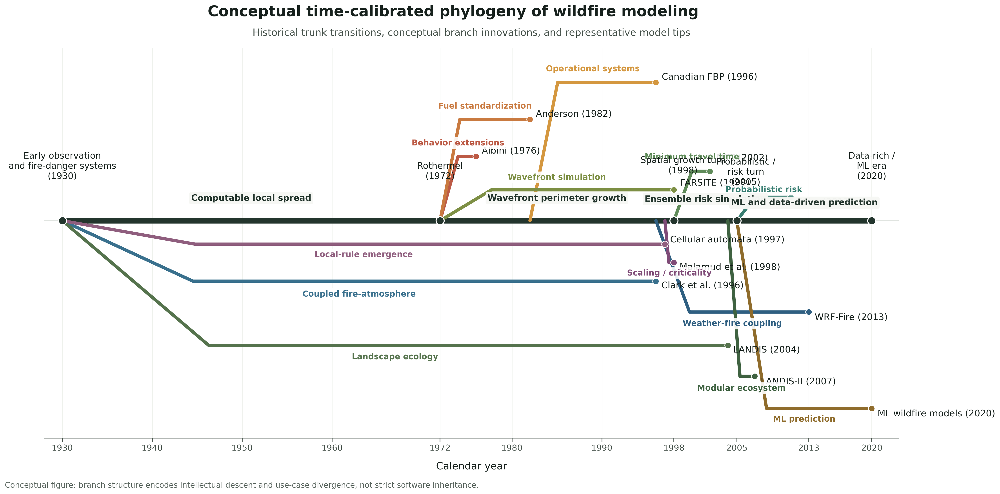
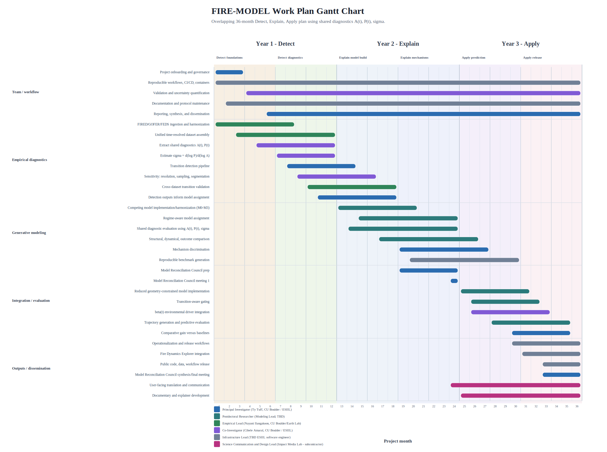

---
hide:
  - title
---

  <section class="ogf-hero">
    

      NSF Proposal Workspace
      <h1>On Growth and Form</h1>
      
This site documents a developing NSF wildfire-scaling research concept centered on growth, form, scaling, geometry, and event-based Earth system analysis. It is designed to support proposal writing while also functioning as a coherent map of the project's scientific architecture.

      

        <a class="md-button md-button--primary" href="project-overview/review-resubmission-strategy/">Read the strategy document</a>
        <a class="md-button" href="project-overview/">Project overview</a>
        <a class="md-button" href="methods/">Theory and methods</a>
      

    

  </section>

  <section class="ogf-band">
    

      

        
      

      

        <h3>Project frame</h3>
        <h2>What this project is</h2>
        
The project asks whether wildfire growth can be understood as an emergent geometric process, with rough expanding fronts, fractal perimeter structure, and regime-specific scaling behavior. If those patterns are real, they would help connect wildfire science to broader theories of interface growth, percolation, and complex systems.

        
Wildfire science already has strong traditions in fire behavior physics and fire regime statistics. What remains less developed is the intermediate scale: how individual fires grow through space and time as geometric objects. Daily fire perimeters derived from satellite observations now make that question tractable.

      

    

  </section>

  <section class="ogf-band ogf-band--dark ogf-band--reverse">
    

      

        <h3>Scientific rationale</h3>
        <h2>Why “On Growth and Form”</h2>
        
The site takes its title from D'Arcy Wentworth Thompson's <em>On Growth and Form</em>, not as a historical ornament but as an intellectual starting point. Thompson argued that living form cannot be explained only by history or adaptation; it must also be understood through geometry, mechanics, and the constraints imposed by physical processes. This project extends that sensibility into wildfire science by asking whether fire growth also exhibits lawful large-scale form.

        
The <a href="project-overview/causal-history-wildfire-modeling/">Causal History of Wildfire Modeling</a> and the <a href="planning/wildfire-modeling-phylogeny/">Wildfire Modeling Phylogeny</a> together trace how this proposal builds from earlier modeling traditions while shifting attention toward event geometry, growth trajectories, and scaling diagnostics.

      

      

        
      

    

  </section>

  <section class="ogf-band">
    

      

        
      

      

        <h3>Data and execution</h3>
        <h2>How FIRED and CubeDynamics support the work</h2>
        
<code>FIRED</code> reconstructs coherent wildfire events from burned-area observations, turning pixels into time-resolved fire histories. <code>CubeDynamics</code> provides the computational language for aligning those event histories with weather, vegetation, climate, and landscape data in a shared spatiotemporal analysis framework.

        
Together they make it possible to study wildfire growth as a measurable Earth system process rather than as an after-the-fact burn scar. The <a href="research-program/">research program</a>, <a href="methods/">methods sequence</a>, and <a href="data-infrastructure/">data and infrastructure pages</a> preserve the long-form proposal scaffolding behind that claim.

      

    

  </section>

  <section class="ogf-news">
    

      

        <h2>Current working materials</h2>
        
Use the site as an editorial workspace: the long-form documents remain the primary source for framing, requirements, methods, and execution planning.

      

      

        <article class="ogf-card">
          

            
          

          

            Proposal
            <h3>Resubmission strategy</h3>
            
The main collaborator-facing memo summarizes the narrative shift, benchmark structure, deliverables, and acceptance criteria for the next FIRE-MODEL submission.

            
<a href="project-overview/review-resubmission-strategy/">Open the strategy document</a>

          

        </article>
        <article class="ogf-card">
          

            
          

          

            Methods
            <h3>Methods system</h3>
            
Follow the measurement, model comparison, generative modeling, and synthetic validation sequence without collapsing the technical detail into a short landing-page summary.

            
<a href="methods/">Browse the methods section</a>

          

        </article>
        <article class="ogf-card">
          

            
          

          

            Planning
            <h3>Work plan and timeline</h3>
            
Keep the execution logic, staffing, evaluation, and broader impacts notes connected to the proposal architecture rather than separated into standalone slideware.

            
<a href="planning/">Review planning materials</a>

          

        </article>
      

    

  </section>

  <section class="ogf-callout">
    

      

        <h2>Start here for the resubmission</h2>
        
The <a href="project-overview/review-resubmission-strategy/">FIRE-MODEL Resubmission Strategy Document</a> is the primary shareable memo for collaborator alignment on the revision plan.

        <a class="md-button" href="https://github.com/CU-ESIIL/on_growth_and_form">Open repository on GitHub</a>
      

      

        <h2>How the site is organized</h2>
        <ul>
          <li><code>Start Here</code> collects repository navigation, workflow guidance, and the main strategy memo.</li>
          <li><code>Proposal</code> keeps the funder, the call, and the proposal framing in view.</li>
          <li><code>Theory</code>, <code>Methods</code>, and <code>Models</code> preserve the long-form scientific argument.</li>
          <li><code>Work Plan</code>, <code>Planning</code>, and <code>Literature</code> retain execution details, evaluation, and citation support.</li>
        </ul>
      

    

  </section>

