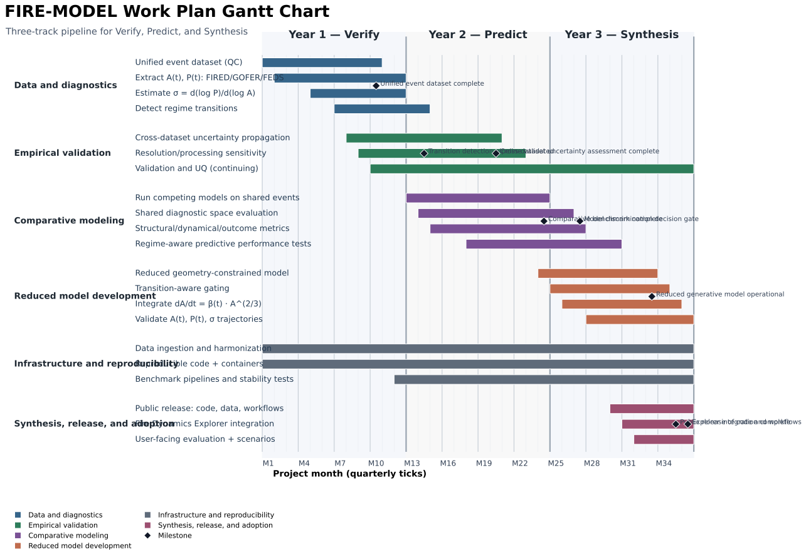

# FIRE-MODEL Work Plan

## Overview

This figure summarizes the FIRE-MODEL project as an overlapping **Verify → Predict → Synthesis** program over 36 months. It emphasizes legibility for proposal insertion and aligns task language with the current proposal timeline.

---

## Gantt Chart

- Primary checked-in asset: [fire_model_gantt_verify_predict_synthesis.svg](../assets/figures/fire_model_gantt_verify_predict_synthesis.svg)
- To regenerate print assets (PNG/PDF), run: `python3 scripts/generate_fire_model_gantt.py --all-formats`

---

## Figure Legend

**Time framing (x-axis)**
- Year 1 — **Verify**
- Year 2 — **Predict**
- Year 3 — **Synthesis**

**Core logic reflected in tasks**
- **Verify:** observational detection of regime transitions from `A(t)`, `P(t)`, and `σ`.
- **Predict:** comparative evaluation of competing structural assumptions in a shared diagnostic space.
- **Synthesis:** reduced geometry-constrained model, transition-aware gating, release, and user-facing deployment.

**Workstreams shown**
- Data and diagnostics
- Empirical validation
- Comparative modeling
- Reduced model development
- Infrastructure and reproducibility
- Synthesis, release, and adoption

**Milestones shown as diamonds**
- Unified event dataset complete
- Transition detection pipeline validated
- Cross-dataset uncertainty assessment complete
- Comparative benchmark complete
- Model discrimination decision gate
- Reduced generative model operational
- Public release of code and workflows
- Explorer integration complete

---

## Notes on interpretation

- Workstreams overlap by design rather than proceeding as a strict sequence.
- Data ingestion, validation, and uncertainty quantification continue across the full timeline.
- Model development begins in Year 2 and extends into Year 3.
- Infrastructure and reproducibility support all phases and culminate in release and Fire Dynamics Explorer integration.
